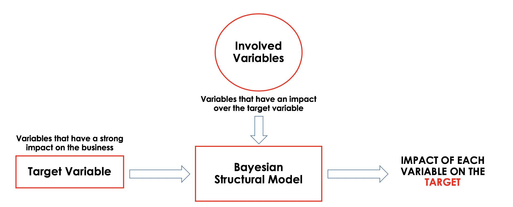

# HVA: High Value Actions model

This was my first model I did for USA. They gave me historical time series from Linkeind and Facebook (Also twitter but the history was insufficient) and wanted to weight the actions in order to understand which one contributes more to the KPI (business variable). 

A good image can summarize more than 1000 words...

Because of the nature of this dataset, missing data was interpolated using spline method, then I studied the power spectral density in order to detect hidden stationaries and finally I applied the BSTS model. The election of this model was because it has a very interesting point of view: you can decompose the target variable as Target = Trend + Seasonality + B*Regressors
Where B are the beta coefficients (the final result) and the regressors are those variables that we want to measure.

When I first started with this project the initial task was to find the impact of some regressors over sales... I got a bit mad trying to solve this out when finally, a Digital manager told me: "my poor guy engagement and sales aren’t related", so the second thing I said to myself was prove it. That's why I did a beautiful graph showing the relations between variables and fortunately target variables weren’t related with regressor ones.

